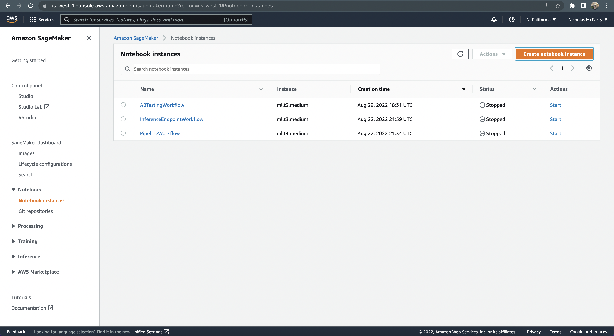
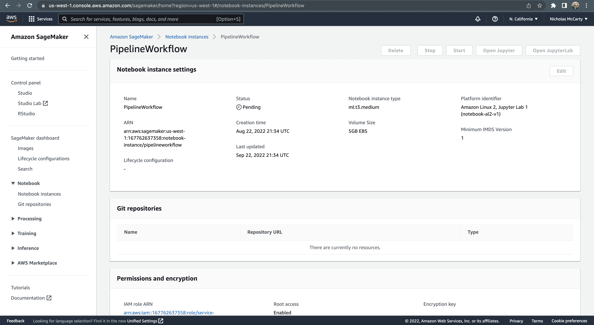
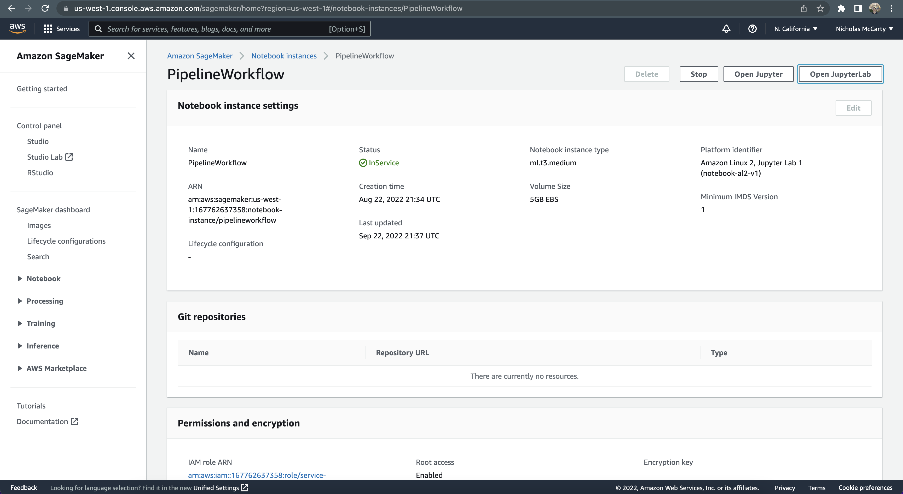
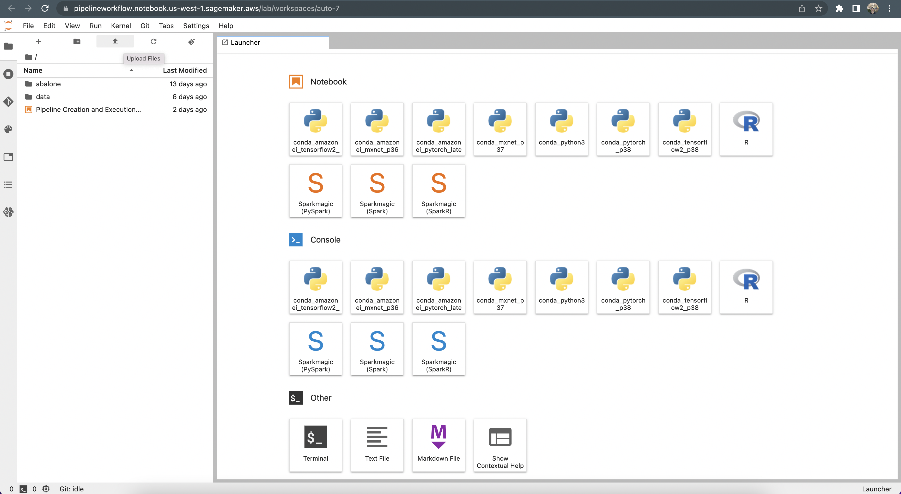
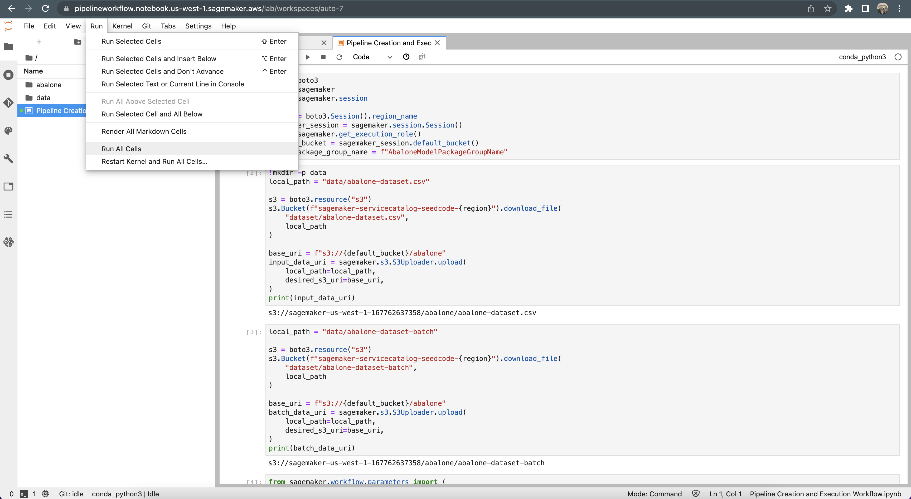
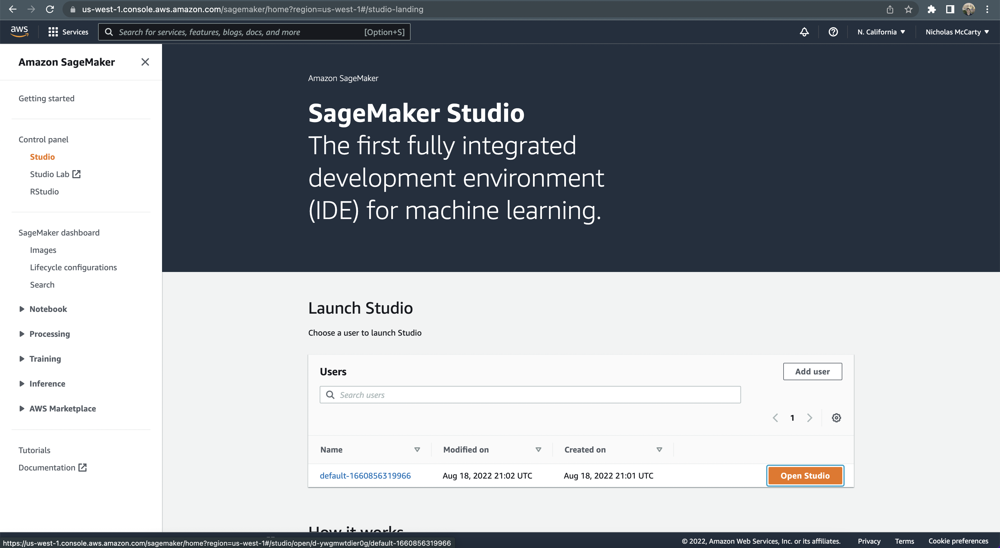
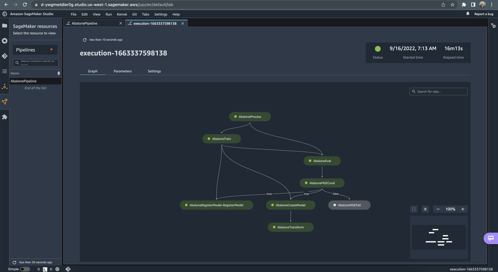

# Pair Programming: Pipeline Execution on AWS

## Introduction

In this exercise, you'll work with a partner to replicate the workflow covered in the [Pipeline Creation](https://github.com/flatiron-school/DS-Deloitte-07062022-Architecting-Pipelines-with-AWS/blob/main/Pipeline%20Creation.ipynb) and [Pipeline Execution](https://github.com/flatiron-school/DS-Deloitte-07062022-Architecting-Pipelines-with-AWS/blob/main/Pipeline%20Execution.ipynb) lectures!

## Objectives

You will be able to:

- Generate a directed acyclic graph (DAG) in the form of a JSON pipeline definition
- Define a set of Pipeline parameters that can be used to parametrize a SageMaker Pipeline
- Execute steps that create a model from the model artifacts used in training
- Perform batch transformation based on the model that was created

## Quick Start

1. Create a `notebook instance` on SageMaker:

2. Start the created notebook instance:

**Note:** *Your notebook instance will refect a status of `Pending` for a couple minutes (as shown below):*

3. Open JupyterLab interface:

4. Upload [the provided notebook](https://github.com/flatiron-school/DS-Deloitte-07062022-PairProgramming-PipelineExecution/blob/solution/Pipeline%20Creation%20and%20Execution%20Workflow.ipynb):

**Note:** *You will not see any files in your directory yet, unlike in the image below.*

5. Double-click on the uploaded notebook:

6. Run all cells:

7. Scroll down, then uncomment and run each of the Pipeline Execution steps, which will take about 15 minutes.

8. Monitor pipeline execution progress using the SageMaker Studio interface:

